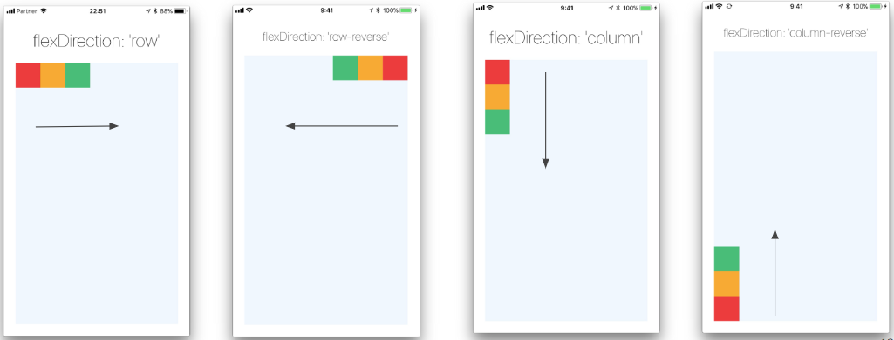

# EP 02 : JSX and Flexbox CSS

## JSX
JSX (JavaScript XML) is a syntax extension for JavaScript that is commonly used in React and React Native applications. It allows you to write HTML-like code within JavaScript, making it easier to define the structure and appearance of user interfaces. JSX is a fundamental part of React Native development. Here's an overview of JSX in React Native:

**JSX Syntax**

JSX resembles HTML syntax but is used within JavaScript code. It allows you to write component structures and define their properties. Here's an example of JSX code in a React Native component:

```javascript
import React from 'react';
import { View, Text, StyleSheet } from 'react-native';

const App = () => {
  return (
    <View style={styles.container}>
      <Text style={styles.text}>Hello, React Native!</Text>
    </View>
  );
};

const styles = StyleSheet.create({
  container: {
    flex: 1,
    justifyContent: 'center',
    alignItems: 'center',
  },
  text: {
    fontSize: 20,
    fontWeight: 'bold',
  },
});

export default App;
```

**JSX Features**

- Component Rendering: JSX allows you to define the structure of your components by using HTML-like tags. Components can be nested within each other to create complex UI hierarchies.
- Embedding JavaScript Expressions: JSX supports embedding JavaScript expressions using curly braces {}. This allows you to dynamically generate content or access variables within JSX elements.
- Component Props: JSX allows you to pass properties (props) to components using HTML attributes. These props can be accessed within the component and used to customize its behavior and appearance.
- Style Declarations: JSX supports inline style declarations using JavaScript objects. You can define styles and apply them directly to JSX elements using the style attribute.
- Conditional Rendering and Loops: JSX allows you to use JavaScript expressions within curly braces to conditionally render elements or create loops to generate repetitive elements.
- Event Handling: JSX enables you to attach event handlers to elements using familiar HTML attributes such as onClick, onPress, etc. These event handlers can trigger actions or update component state.

**JSX Transformation**

Under the hood, JSX code is transformed into regular JavaScript function calls. Tools like Babel are commonly used to transpile JSX into JavaScript that can be executed by the browser or mobile platform.

When working with React Native, the JSX code is transformed into React Native-specific function calls that create and update native UI components on the device.

JSX is an essential part of React Native development, as it provides a concise and declarative way to define user interfaces. It combines the power of JavaScript with the expressiveness of HTML-like syntax, making it easier to understand and maintain complex UI structures.


## Flexbox
Flexbox is a CSS layout module that provides a flexible way to arrange and align elements within a container. It allows you to create responsive and dynamic layouts that adapt to different screen sizes and orientations. The flex container holds the flex items and applies the flexbox layout. The flex items are the child elements of the flex container that participate in the flex layout. Here's a breakdown of the flex container and flex item properties :

<figure class="image">
    
    <figcaption>Fig x : container and item</figcaption>
</figure>


**Flex Container Properties:**

To enable flexbox layout, you need to apply the following properties to the parent container:

1. display: Set the value to flex or inline-flex to establish a flex container. The flex value creates a block-level container, while inline-flex creates an inline-level container.

1. flex-direction: Determines the main axis along which flex items are laid out. It can be set to row (default), row-reverse, column, or column-reverse.

1. flex-wrap: Specifies whether flex items should wrap to a new line if they don't fit in a single line. The values can be nowrap (default), wrap, or wrap-reverse.

1. justify-content: Defines the alignment of flex items along the main axis. It can be set to flex-start (default), flex-end, center, space-between, space-around, or space-evenly.

1. align-items: Determines how flex items are aligned along the cross axis. The options are flex-start, flex-end, center, baseline, or stretch (default).

1. align-content: Specifies the alignment of multiple lines of flex items when they wrap. The possible values are flex-start, flex-end, center, space-between, space-around, or stretch (default).

**Flex Item Properties:**

Flex items are the child elements within a flex container. The following properties can be applied to flex items:

1. flex: Specifies the flex grow, flex shrink, and flex basis values of a flex item. It is a shorthand property for flex-grow, flex-shrink, and flex-basis in that order.

1. flex-grow: Determines how much the flex item should grow relative to other flex items within the same flex container. It takes a positive number as a value.

1. flex-shrink: Sets the ability of the flex item to shrink if necessary. It takes a positive number as a value.

1. flex-basis: Specifies the initial size of a flex item before free space is distributed. It can be set to a length value (e.g., px, em) or keywords like auto.

1. align-self: Overrides the align-items property for a specific flex item. It can be set to auto, flex-start, flex-end, center, baseline, or stretch.

With these properties, you can create various flexible layouts using flexbox. By combining different values and adjusting container and item properties, you can control the alignment, spacing, and wrapping behavior of your elements within a flex container.

It's important to note that flexbox is well-supported by modern browsers, but some older browsers may require vendor prefixes for certain properties. To ensure broad compatibility, it's recommended to include appropriate vendor prefixes or consider using a CSS preprocessor like Sass or PostCSS with autoprefixer to handle vendor prefixes automatically.

You can find detailed information, examples, and tutorials on flexbox in the official CSS specification (https://www.w3.org/TR/css-flexbox-1/) and various online resources dedicated to CSS layout, such as MDN Web Docs (https://developer.mozilla.org/en-US/docs/Web/CSS/CSS_Flexible_Box_Layout).

## How to use properties in detail

### Potion

- **flex** : will define how your items are going to “fill” over the available space along your main axis. Space will be divided according to each element's flex property.

```jsx
<View style={{flex: 1, flexDirection: 'column'}}>
    <View style={{flex : 1 , backgroundColor: 'red'}} />
    <View style={{flex : 2 , backgroundColor: 'orange'}} />
    <View style={{flex : 3 , backgroundColor: 'green'}} />
</View>
```
<figure class="image">
    
    <figcaption>Fig x : flex and direction column</figcaption>
</figure>


```jsx
<View style={{flex: 1, flexDirection: 'row'}}>
    <View style={{flex : 1 , backgroundColor: 'red'}} />
    <View style={{flex : 2 , backgroundColor: 'orange'}} />
    <View style={{flex : 3 , backgroundColor: 'green'}} />
</View>
```
<figure class="image">
    
    <figcaption>Fig x : flex and direction row</figcaption>
</figure>

### Direction, Justify, Align
- **flexDirection** controls the direction in which children of a node are laid out. This is also referred to as the main axis. The cross axis the the axis perpendicular to the main axis, or the axis which wrapping lines are laid out in.

    - **row** Align children from left to right. If wrapping is enabled then the next line will start under the first item on the left of the container.
    - **column** (default value) Align children from top to bottom. If wrapping is enabled then the next line will start to the left first item on the top of the container.
    - **row-reverse** Align children from right to left. If wrapping is enabled then the next line will start under the first item on the right of the container.
    - **column-reverse** Align children from bottom to top. If wrapping is enabled then the next line will start to the left first item on the bottom of the container.


```jsx
<View style={{flex: 1, flexDirection: 'row'}}>
    <View style={{
        width: 50, height: 50, 
        backgroundColor: 'powderblue'}} />
    <View style={{
        width: 50, height: 50, 
        backgroundColor: 'skyblue'}} />
    <View style={{
        width: 50, height: 50, 
        backgroundColor: 'steelblue'}} />
</View>
```
<figure class="image">
    
    <figcaption>Fig x : container flexDirection row and items</figcaption>
</figure>

<figure class="image">
    
    <figcaption>Fig x : container flexDirection</figcaption>
</figure>

- **justifyContent** describes how to align children within the main axis of their container. For example, you can use this property to center a child horizontally within a container with flexDirection set to row or vertically within a container with flexDirection set to column.
    - **flex-start** (default value) Align children of a container to the start of the container's main axis.
    - **flex-end** Align children of a container to the end of the container's main axis.
    - **center** Align children of a container in the center of the container's main axis.
    - **space-between** Evenly space of children across the container's main axis, distributing remaining space between the children.
    - **space-around** Evenly space of children across the container's main axis, distributing remaining space around the children. Compared to space-between using space-around will result in space being distributed to the beginning of the first child and end of the last child.
- **alignItems** describes how to align children along the cross axis of their container. Align items is very similar to justifyContent but instead of applying to the main axis, alignItems applies to the cross axis.
    - **stretch** (default value) Stretch children of a container to match the height of the container's cross axis.
    - **flex-start** Align children of a container to the start of the container's cross axis.
    - **flex-end** Align children of a container to the end of the container's cross axis.
    - **center** Align children of a container in the center of the container's cross axis.
    - **baseline** Align children of a container along a common baseline. Individual children can be set to be the reference baseline for their parents.
- **alignSelf** has the same options and effect as alignItems but instead of affecting the children within a container, you can apply this property to a single child to change its alignment within its parent. alignSelf overrides any option set by the parent with aligItems.
    - **stretch** (default value) Stretch children of a container to match the height of the container's cross axis.
    - **flex-start** Align children of a container to the start of the container's cross axis.
    - **flex-end** Align children of a container to the end of the container's cross axis.
    - **center** Align children of a container in the center of the container's cross axis.
    - **baseline** Align children of a container along a common baseline. Individual children can be set to be the reference baseline for their parents.
- **flexWrap** is set on containers and controls what happens when children overflow the size of the container along the main axis. By default children are forced into a single line (which can shrink elements). If wrapping is allowed items are wrapped into multiple lines along the main axis if needed. When wrapping lines alignContent can be used to specify how the lines are placed in the container.
- **alignContent** alignContent defines the distribution of lines along the cross-axis. This only has effect when items are wrapped to multiple lines using flexWrap.
    - **flex-start** (default value) Align wrapped lines to the start of the container's cross axis.
    - **flex-end Align** wrapped lines to the end of the container's cross axis.
    - **stretch** wrapped lines to match the height of the container's cross axis.
    - **center** Align wrapped lines in the center of the container's cross axis.
    - **space-between** Evenly space wrapped lines across the container's main axis, distributing remaining space between the lines.
    - **space-around** Evenly space wrapped lines across the container's main axis, distributing remaining space around the lines. Compared to space between using space around will result in space being distributed to the begining of the first lines and end of the last line.

### Other CSS
- **width and height** The width property in Yoga specifies the width of the element's content area. Similarly height property specifies the height of the element's content area. Both width and height can take following values:
    - **auto** Is the default Value, React Native calculates the width/height for the element based on its content, whether that is other children, text, or an image.
    - **pixels** Defines the width/height in absolute pixels. Depending on other styles set on the component, this may or may not be the final dimension of the node.
    - **percentage** Defines the width or height in percentage of its parent's width or height respectively.
- **padding and margin**
- **absolute and relative** The position type of an element defines how it is positioned within its parent.
    - **relative** (default value) By default an element is positioned relatively. This means an element is positioned according to the normal flow of the layout, and then offset relative to that position based on the values of top, right, bottom, and left. The offset does not affect the position of any sibling or parent elements.
    - **absolute** When positioned absolutely an element doesn't take part in the normal layout flow. It is instead laid out independent of its siblings. The position is determined based on the top, right, bottom, and left values.

## Game with Flexbox froggy

- Practice make you more understand
- http://flexboxfroggy.com/ (Play this game 10 - 30 minutes)

<figure class="image">
    
    <figcaption>Fig x : flexbox froggy game</figcaption>
</figure>

## 12 Exercises to understand flexbox CSS  
<figure class="image">
    
    <figcaption>Fig x : flexbox exercises</figcaption>
</figure>


## Reference
- https://css-tricks.com/snippets/css/a-guide-to-flexbox/#flexbox-background